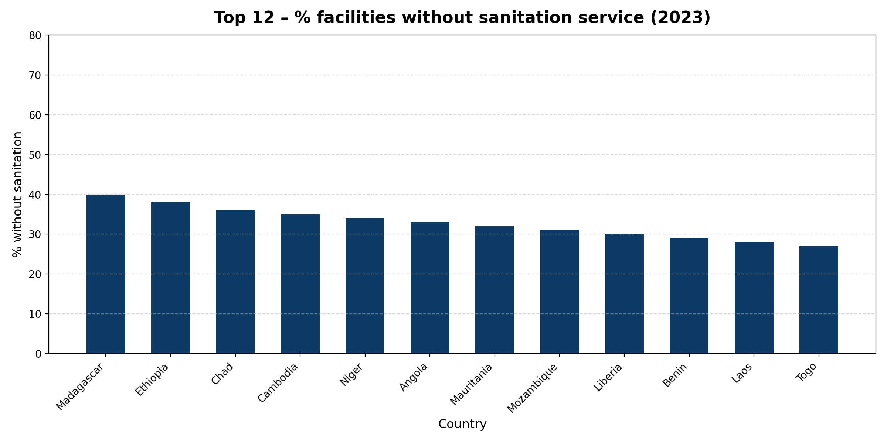

# Building resilience from the inside out: WASH in health-care systems

**2 BILLION PEOPLE** rely on healthcare facilities that lack basic water services. **Meaning that** :
- Spread of preventable diseases and heightened risk of infection  
- Increased maternal and newborn mortality  
- Lower life expectancy at birth

First, a look on the global situation : 
HOW MUCH DO COUNTRIES INVEST IN HEALTH ?

To see the interactive version: [Open map →]({{ site.baseurl }}/html/plot2_world.html)


To see the code > [html/plot2_world_code.html](html/plot2_world_code.html) sur GitHub.

This map shows the proportion of the GPD allocated to health expenditures and highlights the most deprived areas . Yet, behind the numbers hides a deeper crisis — one that begins with **HYGENE**.

COVID-19 was a wake-up call.
The pandemic put the spotlight back on
health care importance and exposed how
fragile even the strongest health systems can be. Around the world, underinvestment and
poor infrastructure pushed hospitals to their
limits.
*But funding is only part of the story.*

**No clean water. Unsafe conditions. Lack of toilets.**
Here are the 12 countries where health facilities are facing the most severe crisis: up to 40% of centers lack sanitation services. This makes basic care unsafe, especially for mothers, newborns, and the elderly.
These findings highlight the urgent need for investment in WASH (water, sanitation, hygiene) infrastructure in healthcare systems and especially in burning zones as Africa and South-East Asia.



## 5. Top 12 Countries – % Facilities without Sanitation


<details>
 <summary>See the code</summary>

```python
from plotnine import (
    ggplot, aes, geom_col,
    scale_y_continuous, theme_minimal,
    theme, element_text, labs
)
import pandas as pd

df = pd.read_csv('unicef_indicator_1(7).csv')
last_year = df['time_period'].max()
df_latest = (
    df[df['time_period']==last_year]
      .sort_values('obs_value', ascending=False)
      .head(12)
      .rename(columns={
         'geo_area_name':'country',
         'obs_value':'no_sanitation_pct'
      })
)
top12 = df_latest[['country','no_sanitation_pct']]

p = (
    ggplot(top12, aes(x='country', y='no_sanitation_pct'))
    + geom_col(fill='#0d3b66', width=0.6)
    + scale_y_continuous(expand=(0,0), breaks=range(0,81,10))
    + theme_minimal(base_size=12)
    + theme(
        figure_size=(12, 6),
        axis_text_x=element_text(rotation=45, hjust=1, size=10),
        axis_title_y=element_text(size=12),
        plot_title=element_text(size=14, weight='bold', margin={'b':12})
      )
    + labs(
        title=f"Top 12 countries – % without sanitation ({last_year})",
        x='Country',
        y='% without sanitation'
      )
)

output_path = 'top12_nosanitation.png'
p.save(f'docs/img/{output_path}', width=12, height=6, dpi=200)
</details> ```


Behind the numbers, real lives at stake.
In these under-equipped health centers, women give birth without clean water and wounds are treated without soap but this is not just a hygiene issue. It's a daily threat to life, dignity, and care quality that the population of these countries are enduring.

*BUT THEN...*
**WHAT IS AT STAKE FOR HUMAN HEALTH?**

Life expectancy is one of the most telling indicators of a population’s overall well-being. Thanks to this graph, we clearly see that poor sanitation in healthcare facility directly influences the longevity of a population.
Countries with poor healthcare sanitation tend to show significantly lower life expectancy rates.

This decline reflects deeper issues: higher infant and maternal mortality, poor disease control, and limited access to quality care : the actual symptoms of a systemic problem.

**NEXT STEPS ?** Building resilience from the inside out


**Average % of facilities without sanitation service**  

If there is no real action implemented, the raise will keep on increasing through time.
Emergency aid is no longer enough. What vulnerable countries need is not just donations—but long-term, structural
partnerships.
NGOs and local governments must co-design sustainable WASH (Water, Sanitation, Hygiene) infrastructures, train
local health workers, and ensure knowledge transfer.
Empowerment, not dependence, is key: let’s move from charity to capacity-building.Investing in resilient health systems is investing in human dignity, global stability, and future pandemics prevention.


CURRENT SITUATION - The US President Donald Trump recently voted the cut of American support to major global health NGOs.
For example : USAID ~ up to $65 Bn in 2023.


