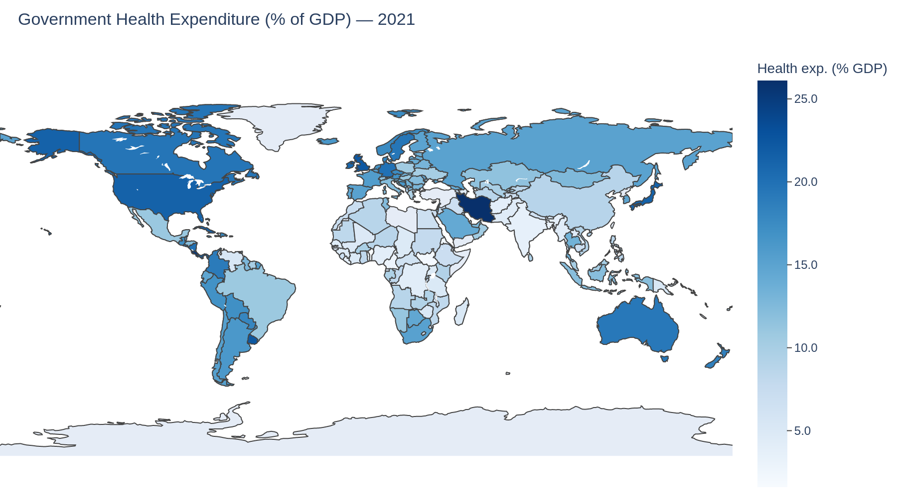

 
Building resilience from the inside out: WASH in health-care systems

**2 BILLION PEOPLE** rely on healthcare facilities that lack basic water services.

**Meaning that**  
- Spread of preventable diseases and heightened risk of infection  
- Increased maternal and newborn mortality  
- Lower life expectancy at birth

**Interactive version** : [Open map →](/plot2_world.html)

<iframe src="/plot2_world.html"
        width="900" height="500"
        style="border: none;">
</iframe>

---

Interactive version: [Open map →](html/plot2_world.html)

