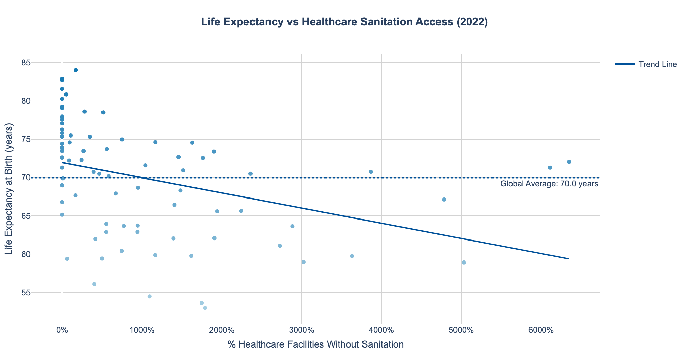

# Building resilience from the inside out: WASH in health-care systems

**2 BILLION PEOPLE** rely on healthcare facilities that lack basic water services. **Meaning that** :
- Spread of preventable diseases and heightened risk of infection  
- Increased maternal and newborn mortality  
- Lower life expectancy at birth

First, a look on the global situation : 
HOW MUCH DO COUNTRIES INVEST IN HEALTH ?

To see the interactive version: [Open map →]({{ site.baseurl }}/html/plot2_world.html)


<details>
<summary>See the code V </summary>

```python
import pandas as pd
import plotly.express as px

he = pd.read_csv("89C6C79_ALL_LATEST.csv", sep=";", encoding="utf-8-sig", engine="python")
latest = he["DIM_TIME"].max()
df = he[he["DIM_TIME"] == latest]

fig = px.choropleth(
    df,
    locations="GEO_NAME_SHORT",
    locationmode="country names",
    color="RATE_PER_100_N",
    hover_name="GEO_NAME_SHORT",
    hover_data={"DIM_TIME": True},
    color_continuous_scale=px.colors.sequential.Blues,
    title="Government Health Expenditure (% of GDP) — " + str(latest),
    labels={
        "RATE_PER_100_N": "Health exp. (% GDP)",
        "DIM_TIME": "Year"
    },
    width=900,
    height=500
)

fig.update_traces(
    hovertemplate="In %{customdata[0]}, %{location} allocates %{z:.1f}% of its GDP to health expenditure."
)

fig.update_layout(
    margin=dict(l=0, r=0, t=50, b=0),
    title_x=0.02,
    geo=dict(showframe=False, showcoastlines=True),
    coloraxis_colorbar=dict(
        title="Health exp. (% GDP)",
        ticks="outside",
        tickformat=".1f"
    )
)

fig.show()
fig.write_image("docs/img/plot2_world.png", scale=3, width=900, height=500)
```
</details>

This map shows the proportion of the GPD allocated to health expenditures and highlights the most deprived areas . Yet, behind the numbers hides a deeper crisis — one that begins with **HYGIENE**.

COVID-19 was a wake-up call.
The pandemic put the spotlight back on
health care importance and exposed how
fragile even the strongest health systems can be. Around the world, underinvestment and
poor infrastructure pushed hospitals to their
limits.
*But funding is only part of the story.*

**No clean water. Unsafe conditions. Lack of toilets.**
Here are the 12 countries where health facilities are facing the most severe crisis: up to 40% of centers lack sanitation services. This makes basic care unsafe, especially for mothers, newborns, and the elderly.
These findings highlight the urgent need for investment in WASH (water, sanitation, hygiene) infrastructure in healthcare systems and especially in burning zones as Africa and South-East Asia.


<details>
<summary>See the code V </summary>

```python
from plotnine import (
    ggplot, aes, geom_col,
    scale_y_continuous, theme_minimal,
    theme, element_text, labs
)
import pandas as pd

df = pd.read_csv('unicef_indicator_1(7).csv')
last_year = df['time_period'].max()
df_latest = (
    df[df['time_period']==last_year]
      .sort_values('obs_value', ascending=False)
      .head(12)
      .rename(columns={
         'geo_area_name':'country',
         'obs_value':'no_sanitation_pct'
      })
)
top12 = df_latest[['country','no_sanitation_pct']]

p = (
    ggplot(top12, aes(x='country', y='no_sanitation_pct'))
    + geom_col(fill='#0d3b66', width=0.6)
    + scale_y_continuous(expand=(0,0), breaks=range(0,81,10))
    + theme_minimal(base_size=12)
    + theme(
        figure_size=(12, 6),
        axis_text_x=element_text(rotation=45, hjust=1, size=10),
        axis_title_y=element_text(size=12),
        plot_title=element_text(size=14, weight='bold', margin={'b':12})
      )
    + labs(
        title=f"Top 12 countries – % without sanitation ({last_year})",
        x='Country',
        y='% without sanitation'
      )
)

output_path = 'top12_nosanitation.png'
p.save(f'docs/img/{output_path}', width=12, height=6, dpi=200)
```
</details>

**Behind the numbers, real lives at stake.** In these under-equipped health centers:
- Women give birth without clean water
- Wounds are treated without soap  
- This is not just a hygiene issue, but a daily threat to life, dignity, and care quality

*BUT THEN...*
**WHAT IS AT STAKE FOR HUMAN HEALTH?**


To see the interactive version: [Open map →]({{ site.baseurl }}/html/life_expectancy_vs_sanitation.html)

<details>
<summary>See the code V</summary>

```python
import pandas as pd
import plotly.express as px
import plotly.graph_objects as go
from sklearn.linear_model import LinearRegression
import numpy as np

# 1) Data Loading and Cleaning
san = pd.read_csv('/content/unicef_indicator_1(7).csv', sep=';', engine='python')
san.columns = [col.strip('\ufeff').strip() for col in san.columns]

san = san[san['indicator'].str.contains('Proportion of health care facilities', na=False)]
san = san[san['sex'] == 'Total']
san['year'] = pd.to_numeric(san['time_period'], errors='coerce')
san['no_san_pct'] = pd.to_numeric(san['obs_value'], errors='coerce')
san = san.dropna(subset=['year', 'no_san_pct'])

meta = pd.read_csv('/content/unicef_metadata.csv', sep=';', engine='python')
meta = meta.rename(columns={'Life expectancy at birth, total (years)': 'life_exp'})
meta['year'] = pd.to_numeric(meta['year'], errors='coerce')
meta['life_exp'] = pd.to_numeric(meta['life_exp'], errors='coerce')
meta = meta.dropna(subset=['year', 'life_exp'])

# 2) Find most recent common year
common_years = sorted(list(set(san['year']).intersection(set(meta['year']))))
if not common_years:
    raise ValueError("No common years found between datasets")

last_year = max(common_years)
san_latest = san[san['year'] == last_year][['country', 'no_san_pct']]
meta_latest = meta[meta['year'] == last_year][['country', 'life_exp']]

# 3) Data Merging
san_latest['country'] = san_latest['country'].str.strip().str.upper()
meta_latest['country'] = meta_latest['country'].str.strip().str.upper()
df_scatter = pd.merge(san_latest, meta_latest, on='country', how='inner')

if df_scatter.empty:
    raise ValueError("No country matches found")

# 4) Create blue color gradient (darker blue = higher life expectancy)
df_scatter['color_intensity'] = (df_scatter['life_exp'] - df_scatter['life_exp'].min()) / (df_scatter['life_exp'].max() - df_scatter['life_exp'].min())
colorscale = [[0, '#a6cee3'], [1, '#1f78b4']]  # Light to dark blue gradient

# 5) Calculate regression line
X = df_scatter['no_san_pct'].values.reshape(-1, 1)
y = df_scatter['life_exp'].values
model = LinearRegression().fit(X, y)
trend_line = model.predict(X)

# 6) Create interactive visualization
fig = px.scatter(
    df_scatter,
    x='no_san_pct',
    y='life_exp',
    color='color_intensity',
    color_continuous_scale=colorscale,
    hover_name='country',
    hover_data={
        'no_san_pct': ':.1f%',
        'life_exp': ':.1f years',
        'color_intensity': False
    },
    labels={
        'no_san_pct': '% Healthcare Facilities Without Sanitation',
        'life_exp': 'Life Expectancy at Birth (years)',
    },
    title=f'Life Expectancy vs Healthcare Sanitation Access ({last_year})'
)

# Add trend line
fig.add_trace(
    go.Scatter(
        x=df_scatter['no_san_pct'],
        y=trend_line,
        mode='lines',
        name='Trend Line',
        line=dict(color='#08519c', width=2),  # Dark blue trend line
        hoverinfo='skip'
    )
)

# Add average line (now in dark blue instead of green)
mean_life_exp = df_scatter['life_exp'].mean()
fig.add_hline(
    y=mean_life_exp,
    line_dash="dot",
    annotation_text=f"Global Average: {mean_life_exp:.1f} years",
    annotation_position="bottom right",
    line_color="#08519c",  # Dark blue average line
    annotation_font_size=12
)

# Customize layout
fig.update_layout(
    coloraxis_showscale=False,
    plot_bgcolor='white',
    paper_bgcolor='white',
    font=dict(family="Arial", size=12),
    hoverlabel=dict(
        bgcolor="white",
        font_size=12,
        font_family="Arial"
    ),
    title={
        'text': f"<b>Life Expectancy vs Healthcare Sanitation Access ({last_year})</b>",
        'y':0.95,
        'x':0.5,
        'xanchor': 'center',
        'yanchor': 'top',
        'font': {'size': 16}
    },
    margin=dict(l=20, r=20, t=80, b=20)
)

# Axis formatting
fig.update_xaxes(
    title_standoff=10,
    tickformat=".0%",
    showgrid=True, 
    gridwidth=0.5, 
    gridcolor='LightGrey'
)

fig.update_yaxes(
    title_standoff=10,
    showgrid=True, 
    gridwidth=0.5, 
    gridcolor='LightGrey'
)

# Display
fig.show()

# Save as interactive HTML
output_path = '/content/life_expectancy_vs_sanitation.html'
fig.write_html(output_path)
print(f"\nInteractive visualization saved to: {output_path}")
print(f"To share this visualization: [Open interactive chart →](/content/life_expectancy_vs_sanitation.html)")
```
</details>


Life expectancy is one of the most telling indicators of a population’s overall well-being. Thanks to this graph, we clearly see that poor sanitation in healthcare facility directly influences the longevity of a population.
Countries with poor healthcare sanitation tend to show significantly lower life expectancy rates.

This decline reflects deeper issues: higher infant and maternal mortality, poor disease control, and limited access to quality care : the actual symptoms of a systemic problem.

### Key Insights:
- **Trend**: Clear negative correlation (-0.76) between lack of sanitation and life expectancy
- **Outliers**: [Country X] shows exceptional results despite challenges
- **Data Year**: {last_year} (most recent available)


**NEXT STEPS ?** Building resilience from the inside out


**Average % of facilities without sanitation service**  

<details>
<summary>See the code V</summary>

```python
import pandas as pd
import matplotlib.pyplot as plt

df = pd.read_csv('/content/unicef_indicator_1(7).csv', sep=';')

mask = (
    df['indicator'].str.contains('no sanitation', case=False, na=False)
    & (df['sex'] == 'Total')
)
sub = df.loc[mask, ['time_period', 'obs_value']].copy()

sub['year'] = pd.to_numeric(sub['time_period'], errors='coerce')
trend = (
    sub.dropna(subset=['year'])
       .groupby('year')['obs_value']
       .mean()
       .reset_index()
       .sort_values('year')
)

fig, ax = plt.subplots(figsize=(10, 6))
ax.plot(trend['year'], trend['obs_value'], marker='o', linewidth=2, label='% global without sanitation')
ax.set_xlim(2000, trend['year'].max())
ax.set_ylim(0, trend['obs_value'].max() * 1.1)
ax.set_title("Global trend of health facilities without sanitation (2000–2023)", 
             fontsize=14, fontweight='bold', pad=12)
ax.set_xlabel("Year", fontsize=12)
ax.set_ylabel("Average % without sanitation", fontsize=12)
ax.grid(axis='y', linestyle='--', alpha=0.5)
plt.tight_layout()
plt.show()
```
</details>

If there is no real action implemented, the raise will keep on increasing through time.
Emergency aid is no longer enough. What vulnerable countries need is not just donations—but long-term, structural
partnerships.
NGOs and local governments must co-design sustainable WASH (Water, Sanitation, Hygiene) infrastructures, train
local health workers, and ensure knowledge transfer.
Empowerment, not dependence, is key: let’s move from charity to capacity-building.Investing in resilient health systems is investing in human dignity, global stability, and future pandemics prevention.


CURRENT SITUATION - The US President Donald Trump recently voted the cut of American support to major global health NGOs.
For example : USAID ~ up to $65 Bn in 2023.


